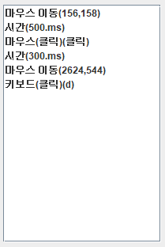
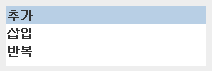
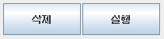
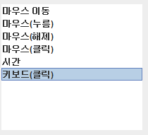
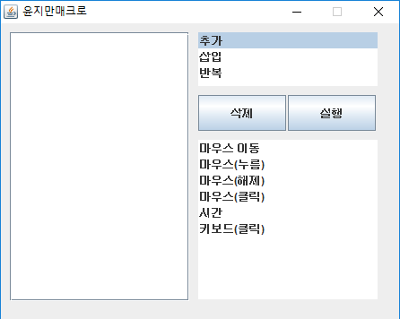
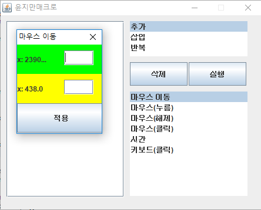
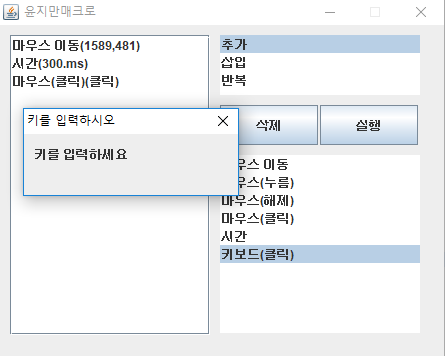

### 실행 패널 
  
Vector<ListStr> 에 담긴 액션을 나타낸다.  
  
### 상태 패널 
  
1. 추가 : 실행패널에 액션을 등록  
2. 삽입 : 실행패널의 액션사이에 액션을 삽입  ( 미구현 )  
3. 반복 : 실행패널의 액션을 반복한다  ( 미구현 )  
  
### 컨트롤 패널

1. 삭제 : 실행패널에 선택된 액션을 삭제 
2. 실행 : 실행 패널에 등록된 액션을 실행  
  
### 액션 패널

1. 마우스이동 : 작은 창이 열리면 Thread를 시작하여 while 반복문으로 마우스 좌표를 찍은후 ListStr.MOVEMOSE 액션을 Vector<ListStr> 에 담는다  
2. 마우스(누름) : ListStr.PRESSMOUSE 액션을  Vector<ListStr> 에 담는다  
3. 마우스(해제) : ListStr.UNPRESSMOUSE 액션을 Vector<ListStr> 에 담는다  
4. 마우스(클릭) : ListStr.CLICKMOUSE 액션을 Vector<ListStr> 에 담는다  
5. 시간 : ListStr.TIME 액션을 Vector<ListStr> 에 담는다  
6. 키보드(클릭) : ListStr.CLICKKEYBOARD액션을  Vector<ListStr> 에 담는다  
  
## -----------------------------------------------------------------
      
